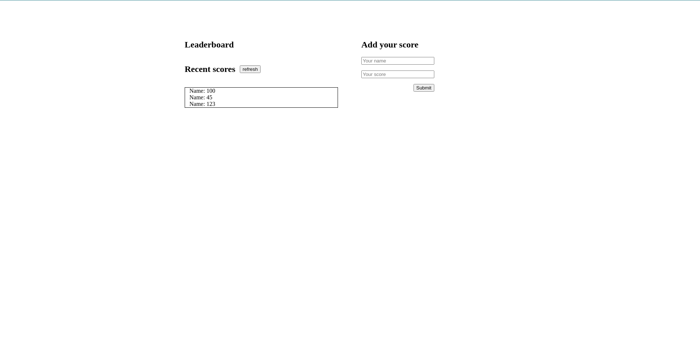

# LeaderBoard

> LeaderBoard

This project allows you to add to a leaderboard for your chess world cup 2021.

## Built With

- HTML, CSS, and JavaScript

To get a local copy up and running follow these simple example steps.

### Setup

To setup the webpack project starting template in your local, in the repo page:
click on code (dropdown list) > Download as ZIP.
or open terminal of path you want to install project and run this command  
`git clone git@github.com:Amrhub/Leaderboard.git`
`cd Leaderboard`

### Deployment

To run the project open folder (after extraction) or cloning then run these commands:  
**`npm install`** to install all dependencies  
**`npm start`** to start the application, you should see the application working at: `http://localhost:8080/`

## Authors

👤 **Amr Ahmed**

- GitHub: [@Amrhub](https://github.com/Amrhub/)
- LinkedIn: [Amr Ahmed](https://www.linkedin.com/in/amr-ahmed-655420191/)

## 🤝 Contributing

Contributions, issues, and feature requests are welcome!

Feel free to check the [issues page](../../issues/).

## Show your support

Give a ⭐️ if you like this project!

## Acknowledgments

### LeaderBoard api 

To interact with this this api here's the url `https://us-central1-js-capstone-backend.cloudfunctions.net/api`  
endpoint  **/games/:id/scores/**  
possible methods `GET POST`

#### Add new player 
You would use `{method: "POST"}` and send body in `JSON` format, e.g `{body: {user: name, score: num}}`

#### Get scores 
You can use endpoint **/games/:id/scores/**   
But this time you will use `{method: "GET"}` also don't forget to use method `.json()` to parse result
 
For more details that's link for this api documentation: 
[Leaderboard api documentation](https://www.notion.so/Leaderboard-API-service-24c0c3c116974ac49488d4eb0267ade3) 
- Microverse helped/guided me building this project

## 📝 License

This project is [MIT](./MIT.md) licensed.
